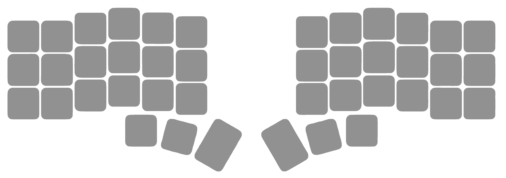

# kbdshrtct (α build)

A powerful keyboard cheatsheet application for visualizing and customizing keyboard layouts, built with [Wails](https://wails.io/) (Go + HTML/CSS/JavaScript).

## Features

- 📋 **Multiple Keyboard Layouts**: Support for Corne (42-key) and Tenkeyless (87-key) keyboards
- 🎨 **Visual Customization**: Upload custom images, change colors, and modify key labels
- 🔄 **Layer Support**: Create and manage multiple keyboard layers (base, lower, raise, custom)
- 🕹️ **Modifier Keys**: Full support for Ctrl, Shift, Alt, Win modifier combinations  
- 💾 **Persistent Storage**: All customizations automatically save and reload
- 🖱️ **Drag & Drop**: Reposition keys anywhere on the layout
- 📱 **Responsive Design**: Works on different screen sizes
- ⚡ **Real-time Updates**: Changes apply instantly

## Screenshots



## Prerequisites

Before building kbdshrtct, ensure you have the following installed:

### 1. Go Programming Language
- **Version**: Go 1.18 or later
- **Download**: https://golang.org/dl/
- **Verify**: Run `go version` in your terminal

### 2. Node.js & npm
- **Version**: Node.js 16+ with npm 8+
- **Download**: https://nodejs.org/
- **Verify**: Run `node --version` and `npm --version`

### 3. Wails CLI
```bash
go install github.com/wailsapp/wails/v2/cmd/wails@latest
```
**Verify**: Run `wails doctor` to check your setup

### 4. Platform-Specific Requirements

#### Windows
- **WebView2**: Usually pre-installed on Windows 10/11
- **If missing**: Download from [Microsoft WebView2](https://developer.microsoft.com/en-us/microsoft-edge/webview2/)

#### macOS  
- **Xcode Command Line Tools**: 
  ```bash
  xcode-select --install
  ```

#### Linux (Ubuntu/Debian)
```bash
sudo apt update
sudo apt install build-essential pkg-config libgtk-3-dev libwebkit2gtk-4.0-dev
```

#### Linux (Fedora/CentOS)
```bash
sudo dnf install gtk3-devel webkit2gtk3-devel gcc pkg-config
```

## Building from Source

### Step 1: Clone the Repository
```bash
git clone https://github.com/jamaldinnnn/kbdshrtct.git
cd kbdshrtct
```

### Step 2: Install Dependencies
```bash
# Install frontend dependencies
cd frontend
npm install
cd ..
```

### Step 3: Build the Application

#### Development Build (with hot reload)
```bash
wails dev
```
This starts a development server with live reloading.

#### Production Build
```bash
wails build
```
The compiled executable will be in `build/bin/`:
- **Windows**: `build/bin/kbdshrtct.exe`
- **macOS**: `build/bin/kbdshrtct.app` 
- **Linux**: `build/bin/kbdshrtct`

### Step 4: Run the Application
```bash
# Windows
./build/bin/kbdshrtct.exe

# macOS
open build/bin/kbdshrtct.app

# Linux
./build/bin/kbdshrtct
```

## Project Structure

```
kbdshrtct/
├── README.md           # This file
├── go.mod             # Go module definition
├── go.sum             # Go dependency checksums
├── wails.json         # Wails configuration
├── main.go            # Application entry point
├── app.go             # Main application logic
├── keyboard.go        # Keyboard layout definitions
├── frontend/          # Frontend assets
│   ├── package.json   # Node.js dependencies
│   ├── index.html     # Main HTML template
│   └── src/
│       ├── main.js    # Frontend JavaScript
│       ├── app.css    # Main stylesheet
│       └── assets/    # Images, fonts, etc.
└── build/             # Build output directory
```

## Usage Guide

### Basic Usage
1. **Launch** the application
2. **Select keyboard type** from the dropdown (Corne or Tenkeyless)
3. **Click any key** to customize it
4. **Upload images**, change colors, or modify labels
5. **Changes auto-save** - close and reopen to verify persistence

### Advanced Features
- **Layer Management**: Use \"+ Add Layer\" to create custom layers
- **Modifier Keys**: Select modifiers (Ctrl, Shift, etc.) to customize key combinations
- **Drag & Drop**: Click and drag keys to reposition them
- **Reset Layout**: Use \"Reset Layout\" to restore original positions

## Configuration

The app stores your customizations in:
- **Windows**: `C:\\Users\\{username}\\.keyboard-cheatsheet\\config.json`
- **macOS**: `~/.keyboard-cheatsheet/config.json`
- **Linux**: `~/.keyboard-cheatsheet/config.json`

## Troubleshooting

### Build Issues

**\"wails command not found\"**
```bash
# Ensure Go bin is in your PATH
export PATH=$PATH:$(go env GOPATH)/bin
# Then reinstall Wails
go install github.com/wailsapp/wails/v2/cmd/wails@latest
```

**Frontend dependencies fail**
```bash
cd frontend
rm -rf node_modules package-lock.json
npm install
```

**WebView2 missing (Windows)**
- Download and install [Microsoft Edge WebView2](https://developer.microsoft.com/en-us/microsoft-edge/webview2/)

### Runtime Issues

**App won't start**
- Check you have the correct WebView2/WebKit installed
- Run `wails doctor` to diagnose system requirements

**Changes don't persist**
- Ensure the app has write permissions to your home directory
- Check if `~/.keyboard-cheatsheet/config.json` is being created

## Development

### Hot Reloading
```bash
wails dev
```
This enables live reloading for rapid development.

### Building for Different Platforms
```bash
# Build for current platform
wails build

# Build for specific platform (cross-compilation)
wails build -platform windows/amd64
wails build -platform darwin/amd64
wails build -platform linux/amd64
```

### Code Structure
- **Backend (Go)**: `main.go`, `app.go`, `keyboard.go`
- **Frontend (JS)**: `frontend/src/main.js`
- **Styling (CSS)**: `frontend/src/app.css`

## Contributing

This is an alpha build. If you encounter bugs or have feature requests:

1. Check existing issues
2. Create detailed bug reports with steps to reproduce
3. Include your OS, Go version, and Node.js version

## License

MIT License - see [LICENSE](LICENSE) file for details.

## Acknowledgments

- Built with [Wails](https://wails.io/)
- Uses [Nunito](https://fonts.google.com/specimen/Nunito) font
- Inspired by keyboard enthusiast communities

---

**Version**: α build  
**Status**: Alpha - expect bugs and breaking changes
